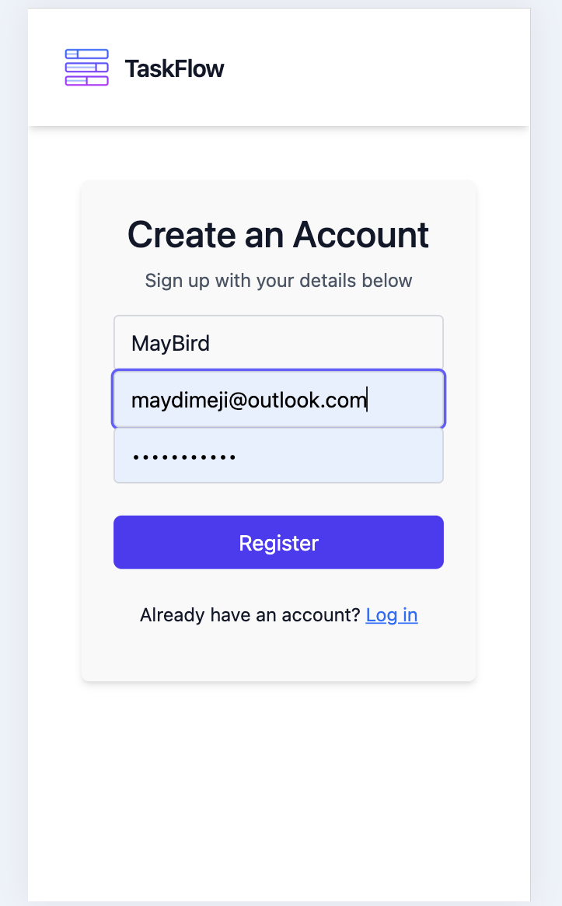
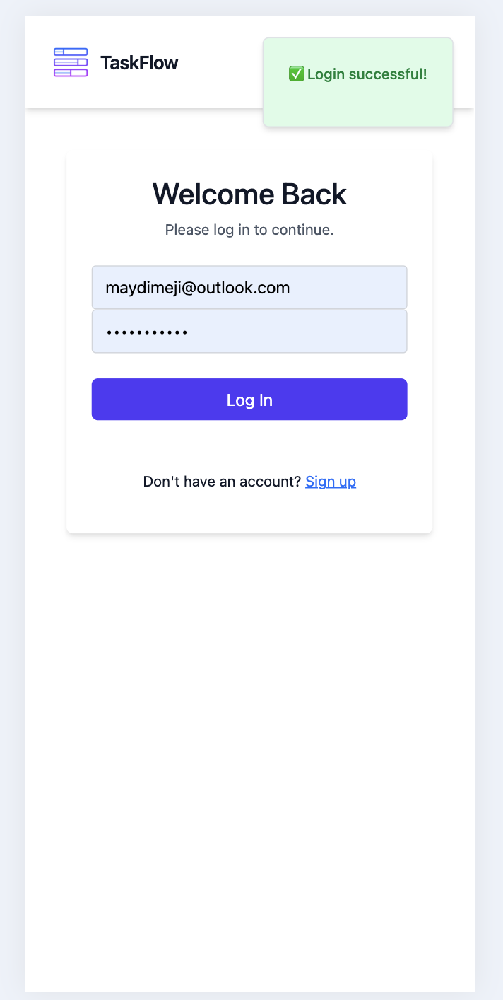
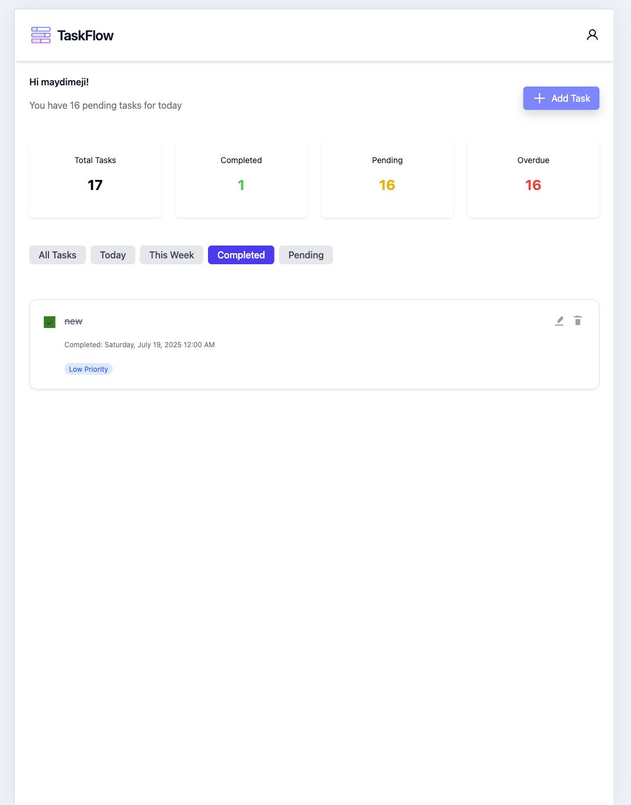
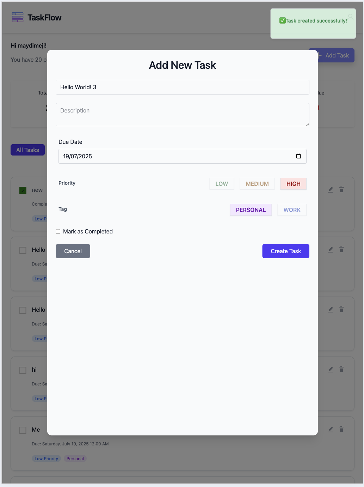
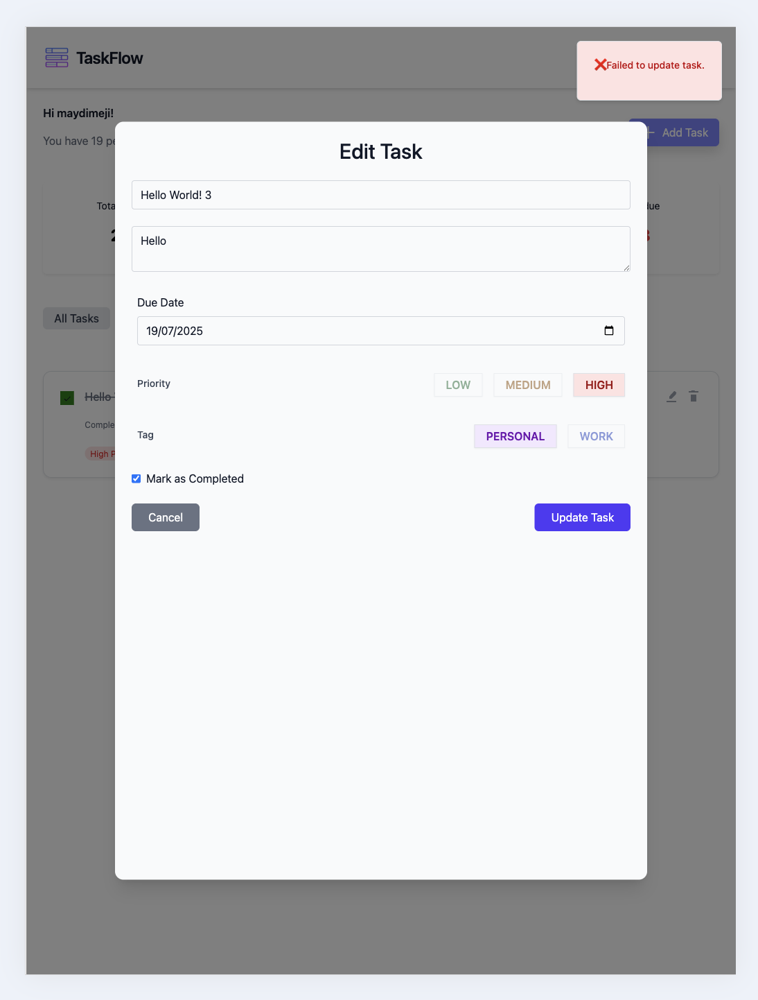
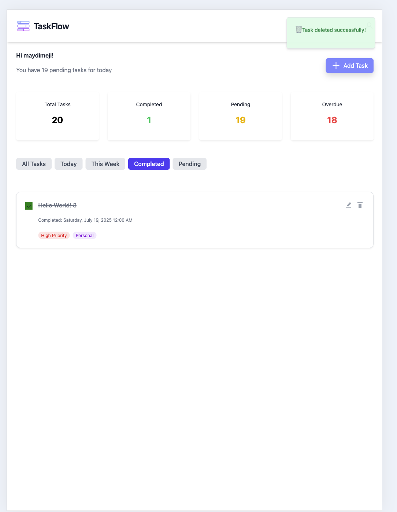
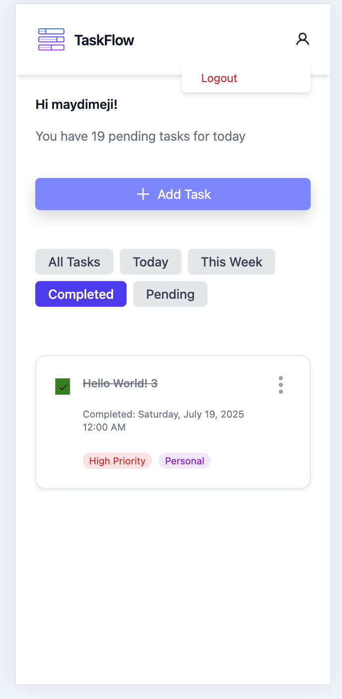

# ✨ TaskFlow UI — Smart Blazor Frontend for Seamless Task Management

TaskFlow is a modern, responsive front-end application built using **Blazor WebAssembly** and **Tailwind CSS**, designed to give users a smooth and visually elegant experience when managing their tasks.

---

## 🚀 High-Level Features

- 🔐 **Authentication**: Secure login and registration using JWT
- 🧾 **Task Management**: Create, edit, delete, and complete tasks
- 🧠 **Smart Caching**: Uses a shared TaskCacheService for seamless UI updates
- 📊 **StatCard Display**: Shows dynamic statistics (Total, Pending, Completed, Overdue)
- 📅 **Filters**: View tasks for Today, This Week, Completed, and Pending
- 📱 **Fully Responsive**: Optimized for mobile and desktop experiences
- 🌙 **Dark Mode**: Gorgeous UI that adapts to light and dark themes
- 🔔 **Shared Notification Component**: Smooth success/error messages across login, register, and task events
- 📦 **State Management**: Uses Blazor's dependency injection and event callbacks to manage app-wide state
- ☁️ **Azure Integrated**: Works with Azure Functions backend APIs for CRUD operations

---

---

## 🛠️ Tech Stack

- **Blazor WebAssembly**
- **Tailwind CSS**
- **.NET 8**
- **Azure Functions (API Backend)**
- **JWT Authentication**
- **State Management via Dependency Injection**

---

# TaskFlow UI – User Journey 🚀

## Below is a visual walkthrough of the TaskFlow user experience, from registration to dashboard management and task operations.

## 📝 Registration Page



---

## 🔐 Login Page



---

## 📊 Dashboard Overview



---

## ➕ Add New Task



---

## ✏️ Edit Task View



---

## ✅ Delete Task View



---

## 📱 Mobile Responsive Menu



---

## 🧪 Setup Instructions

```bash
git clone https://github.com/Mayowa-Dimeji/TaskFlow.git
cd TaskFlow
dotnet run
```

Open your browser at: `http://localhost:5123` (or the configured Kestrel port)

---

## 📄 License

MIT License © 2025 Mayowa Oladimeji
